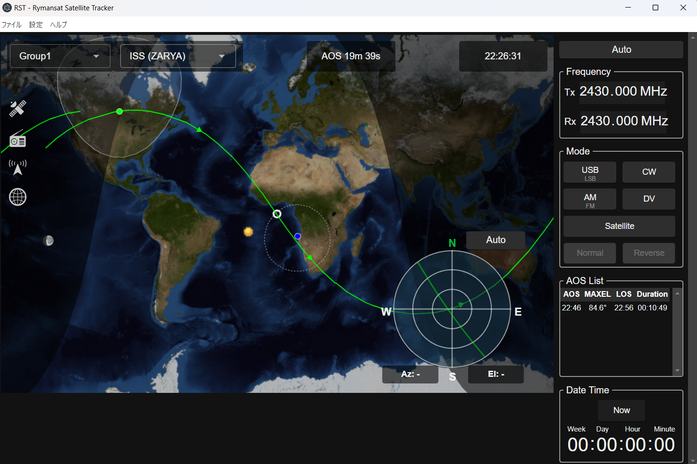
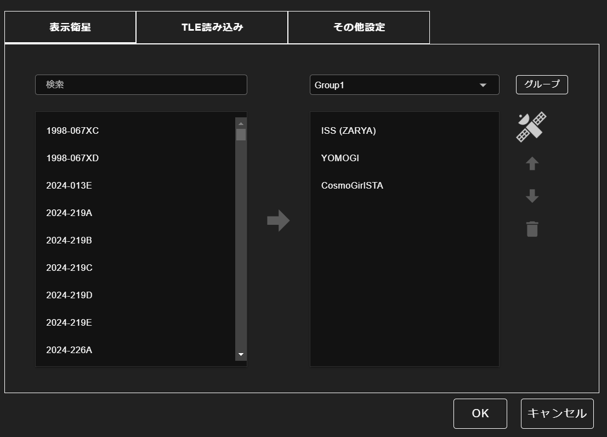
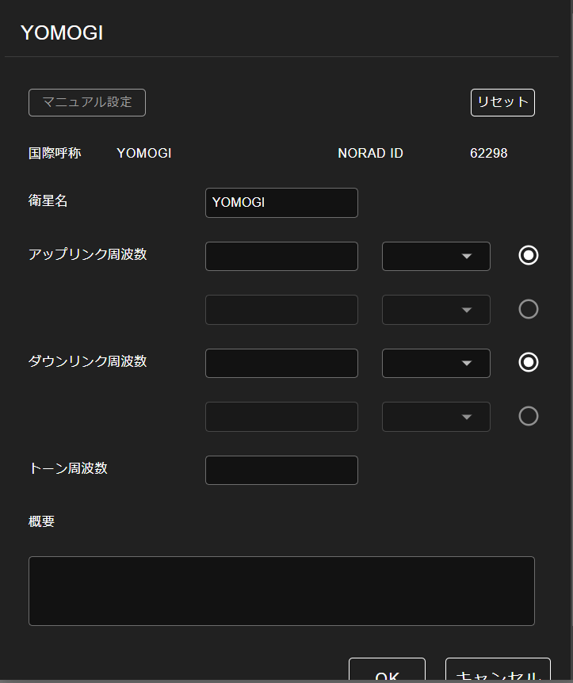
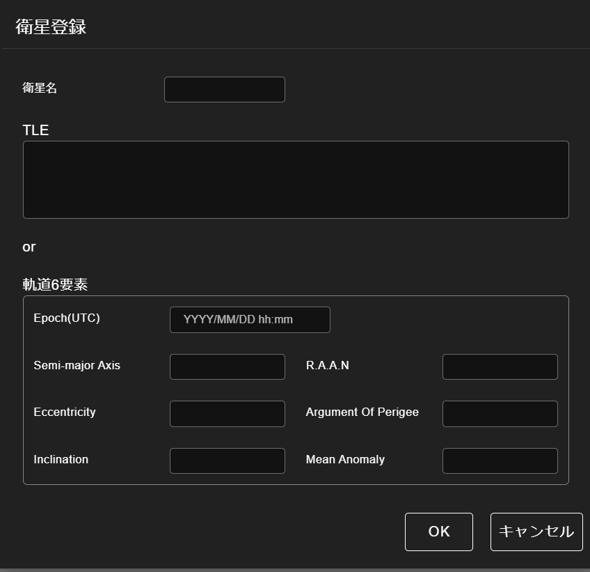
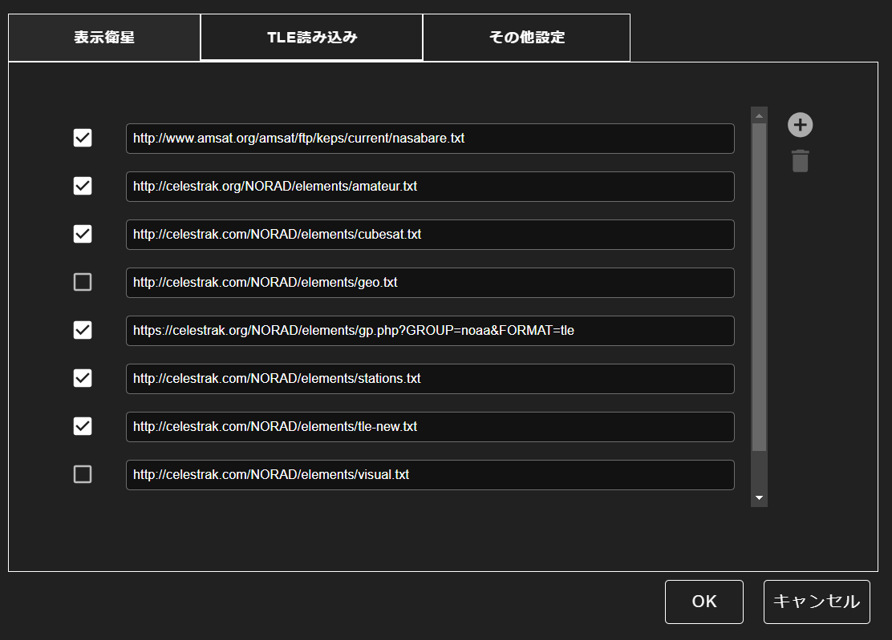
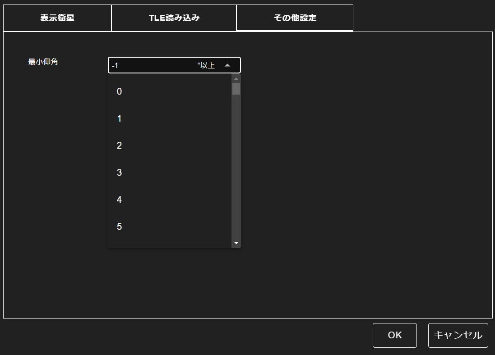
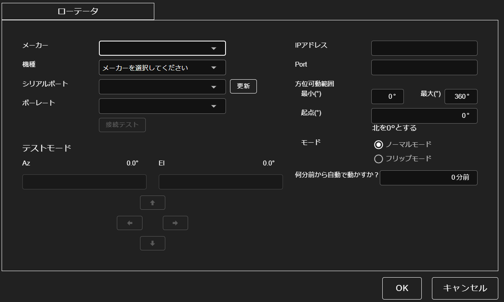
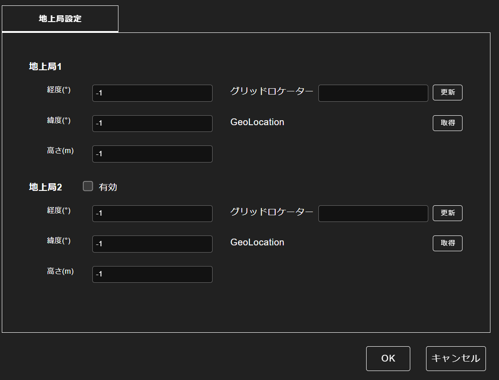

# Rymansat Satellite Tracker マニュアル

# 目次

## 1. 導入時
## 2. メイン画面
### 2.1 メイン画面の詳細
### 2.2 メイン画面メニュー項目（左最上部）
### 2.3 設定アイコン（画面左）
## 3. 衛星設定画面
### 3.1 表示衛星タブ
### 3.2 TLE読み込みタブ
### 3.3 その他設定タブ
## 4. 無線機設定画面
## 5. ローテーター設定画面
## 6. 地上局設定画面
## 7. 操作の流れ
## 8. クレジット、問い合わせ等

# 詳細
## 1. 導入時

## 2. メイン画面
### 2.2 メイン画面メニュー項目（左最上部）
#### 2.2.1 ファイル
#### 2.2.2 設定
#### 2.2.3 ヘルプ

### 2.3 設定アイコン（画面左）
#### 2.3.1 衛星アイコン：衛星設定画面（3章）へ
#### 2.3.2 無線機アイコン：無線機設定画面（4章）へ
#### 2.3.3 アンテナアイコン：ローテーター設定画面（5章）へ
#### 2.3.4 地球アイコン：地上局設定画面（6章）へ

### 2.4 メイン画面タブの項目説明

## 3. 衛星設定画面
- 衛星に関する設定方法
### 3.1 表示衛星タブ
### 3.2 TLE読み込みタブ
### 3.3 その他設定タブ

## 4. 無線機設定画面
- 無線機に関する設定方法

## 5. ローテーター設定画面
- ローテーターに関する設定方法

## 6. 地上局設定画面
- 地上局に関する設定方法

## 7. クレジット、問い合わせ等
- 開発者情報、問い合わせ先など

---
# **Rymansat Satellite Tracker ユーザーマニュアル**

---
## **2. メイン画面**

Rymansat Satellite Tracker(RST) のメイン画面では、**衛星の追跡・アンテナ制御・周波数制御** を行うことができます。

## **2.1 メイン画面の構成と基本操作**
### 2.1 メイン画面の構成
RSTのメイン画面は**上部メニュー・地図表示エリア・制御パネル** の3つのエリアに分かれています。

| **エリア名**       | **機能**                           |
|-------------------|--------------------------------|
| **上部メニュー**   | 設定・ファイル管理・TLE更新・アプリの終了 |
| **2.1.1 地図表示エリア** | 衛星の位置と軌道の表示             |
| **2.1.2-3 衛星選択・時刻表示** | 衛星の選択、パス等時刻の表示             |
| **2.1.4 方位・仰角表示** | 衛星の方位と仰角の表示             |
| **2.1.5-6 周波数、モード等選択**     |  |

#### 2.1.1 地図表示エリア（中央）
**衛星のリアルタイムの位置と軌道が表示されるエリア** です。

| **要素**        | **説明**                               |
|--------------|-----------------------------------|
| **軌道線**  | 衛星の現在の軌道                       |
| **白い円**     | 地上局の可視範囲（衛星が見えるエリア）         |
| **太陽 / 月**  | 現在の太陽と月の位置                    |
| **レーダー表示** | 現在の衛星の方位・仰角（アンテナ指向）を表示 |

設定した衛星の軌道と現在位置を地図上にリアルタイムで表示します。   
地図をドラッグすると位置移動が可能で、スクロール操作により地図の拡大・縮小ができます。   
選択されたグループの衛星の位置（各色の点）、選択した衛星の軌道（線）、衛星の可視範囲（白い範囲）が表示されます。   
グループに２つ以上の衛星を設定した場合は、青色、赤色などの各色の点で表示されます（最大10衛星）。   
衛星の点を左クリック、もしくは左上のドロップダウンによりフォーカスする衛星を切り替えます。   
地上局の緯度経度を設定すると、自局位置（白色）が地図のセンターになります。   
2つ目の地上局が設定されている場合、地図上に黄色で表示されます。   
衛星の位置は1秒ごとに更新されます。   

#### 2.1.2 衛星選択エリア（左上）
衛星をグループごとに管理し、ドロップダウンメニューから追跡する衛星を選択します。   
選択した衛星は地図上で強調表示（各色）され、軌道がリアルタイムで確認できます。   
衛星およびグループの登録は、左の衛星アイコン（衛星設定：3章）から行います。   

#### 2.1.3 時刻表示エリア（中央上）
次のパス（AOS）までの時間を表示しています。   
右の時刻は現在時刻を表示しています。   

#### 2.1.4 方位・仰角表示（中央下）
ローテーターが接続されている場合、メイン画面中央下の円形表示エリアには、選択した衛星の方位（Az） と 仰角（El） が同じ色の点で表示されます。   
円形表示エリア下部に衛星の方位（Az）と仰角（El）の数値、またアンテナの向きが表示されます。   

Autoボタン（ローテーター制御用） により以下の操作が可能です。   

- Autoがオンの場合   
方位（Az） は、アンテナを向けるべき水平方向を示します。北（N）が0°、東（E）が90°、南（S）が180°、西（W）が270°として表示されます。   
仰角（El） は、アンテナを向ける垂直方向（上方向）を示します。水平を0°とし、真上（天頂方向）を90°として表示します。   
衛星の移動に合わせてアンテナ（ローテーター）が方位と仰角を自動追尾します。   
この機能を使用するには、事前にローテーター設定画面でローテーターの設定を完了しておく必要があります。   

- Autoがオフの場合   
自動追尾は停止され、レーダーをダブルクリックすることでアンテナを手動で動かすことが可能になります。   

#### 2.1.5 周波数表示エリア（右上）
画面右上の周波数表示エリアでは、衛星通信のための 送信周波数（Tx） と 受信周波数（Rx） を設定・確認できます。   

- 送信周波数（Tx）   
自局から衛星へ信号を送るための周波数を表示します。   
周波数の変更は、数値欄を直接クリックするか、マウスのスクロールホイールで増減可能です。   

- 受信周波数（Rx）   
衛星から自局に届く信号の周波数を表示します。   
送信周波数と同様に、直接入力またはマウスのスクロール操作で調整可能です。   

無線機接続パターン別　周波数設定画面の動き
| **無線機**          | **運用方法**                                    |
|-------------------|--------------------------------|
| **1台（1バンド）**  | TxRxを同じで運用する                          |
|                   | ~~TxRxを無線機のSPLITモードで分けて運用~~ |
|                   | ~~TxRxを疑似的にPTTを押したときと押さない時で分けて運用~~ |
| ~~**1台（デュアルバンド）**~~ | ~~TxRxを1台で分けて運用~~  |
| ~~**1台（サテライト）**~~ | ~~TxRxを1台で分けて運用~~       |
| ~~**2台（1バンド）**~~   | ~~Tx1台、Rx1台と分けて運用~~  |

また、このエリアには周波数制御を自動で行うための 「Auto」ボタン（周波数制御用） があります。   

- Autoがオンの場合   
選択した衛星の周波数を自動的に適用します。   
具体的には、衛星設定画面で事前に登録された周波数設定を使用します。   

- Autoがオフの場合   
周波数を手動で自由に設定・調整できます。   

#### **2.1.6 モード選択エリア（右中）**
画面右中の **モード選択エリア** では、無線通信の**変調方式（Modulation Mode）** と **サテライトモード（Satellite Mode）** を設定できます。

### **変調方式（Modulation Mode）**
このセクションでは、衛星通信で使用する変調方式を選択できます。   
利用可能なモードは以下の通りです。   

| **モード** | **説明** |
|-----------|---------|
| **USB（Upper Side Band）** | 上側波帯（SSB）を使用するモード |
| **LSB（Lower Side Band）** | 下側波帯（LSB）を使用するモード |
| **CW（Continuous Wave）** | モールス符号（CW通信）を使用するモード |
| **FM（Frequency Modulation）** | 周波数変調（FM通信）を使用するモード |
| **AM（Amplitude Modulation）** | 振幅変調（AM通信）を使用するモード |
| **DV（Digital Voice）** | デジタル音声通信（D-STARなど） |

- **USB/LSB・AM/FMの切り替え**
  - **USBとLSB、AMとFMは同じボタンで切り替え可能** です。
  - クリックするごとに、USB ⇔ LSB、AM ⇔ FM が交互に切り替わります。

### **サテライトモード（Satellite Mode）**
このセクションでは、送受信周波数のモードを設定できます。

| **モード** | **動作** |
|-----------|---------|
| **Normal（ノーマル）** | ノーマルドップラー（FM）　|
| **Reverse（リバース）** | リバースドップラー（SSBやCWで運用する逆ヘテロダインの中継器） |

### **2.1.7 AOSリスト（右中）**
AOSリストは、画面右下の日時設定エリアで設定した日時以降の衛星通過（パス）に関する情報を一覧で表示するエリアです。   
ここでは、衛星が地上局の視界に入る時刻（AOS）から、視界から出る時刻（LOS）までの情報を確認できます。   

#### **AOSリストの各項目**
| **項目**   | **説明** |
|-----------|---------|
| **AOS（Acquisition of Signal）** | 衛星が地上局の視界に入る時刻（HH:MM） |
| **MAXEL（Maximum Elevation）** | 衛星の通過中における最大仰角（°） |
| **LOS（Loss of Signal）** | 衛星が地上局の視界から出る時刻（HH:MM） |
| **Duration** | 衛星が可視範囲にある時間（HH:MM:SS） |

#### **AOSリストの使い方**
- **衛星の通過予定を確認する**
  - AOS（視界に入る時刻）をチェックし、衛星が見える時間帯を事前に把握できます。   
- **最大仰角（MAXEL）を確認する**
  - 高い仰角のパスでは、より強い信号が得られる可能性があります。   
  - 低い仰角の場合、建物や山などの障害物による影響を受けやすくなります。   
- **LOS（視界から出る時刻）をチェック**
  - 通信を行う場合、LOSの時刻までに交信を完了する必要があります。   
- **Duration（通過時間）を参考にする**
  - 長時間（10分以上）可視範囲にいる衛星は、通信やデータ受信のチャンスが多くなります。   

#### 2.1.8 日時設定エリア（右下）
各「Week」「Day」「Hour」「Minute」の数値上でマウスホイールを回転させることで時間を進めることができます。   
「Now」をクリックすると現在の時刻にリセットされます。   

### 2.2 メイン画面メニュー項目（左最上部）

## **上部メニュー**
RST の**上部メニュー**では、設定やファイル管理が可能です。

### **ファイルメニュー**
| **項目**             | **説明**                                      |
|---------------------|------------------------------------------|
| **設定インポート**    | 以前保存した設定ファイルを読み込む                  |
| **設定エクスポート**  | 現在の設定をファイルに保存する                     |
| **TLE更新**(現在無効)        | 最新の軌道データ（TLE）を手動で取得・更新する             |
| **終了**           | アプリケーションを終了する                      |

### **設定メニュー**
| **項目**          | **説明**              |
|------------------|--------------------|
| **言語設定**     | 日本語 / 英語 を切り替える |

### **ヘルプメニュー**
| **項目**      | **説明**                  |
|------------|----------------------|
| **ヘルプ**   | 操作方法のヘルプを表示する （外部Webサイトが表示されます）     |
| **バージョン** | 現在のアプリのバージョンを表示する |

### 2.3 設定アイコン（画面左）
- 3.衛星アイコン（衛星設定）   
- 4.ラジオアイコン（無線機設定）
- 5.アンテナアイコン（ローテーター設定）
- 6.地球アイコン（地上局設定）

## 3.衛星設定画面
- 衛星に関する設定方法

## 衛星設定（タブ1・タブ2・タブ3）
## 3.1 衛星設定タブ1（表示衛星設定）
このタブでは、**追跡する衛星の選択とグループ管理** を行います。

### 📌 画面の構成

| **エリア名** | **機能** |
|-------------|---------|
| **左側（全衛星リスト）** | 使用可能な衛星のリスト（TLEデータから取得） |
| **右側（選択衛星リスト）** | 追跡する衛星のリスト（グループ管理可能） |
| **右メニュー（操作ボタン）** | 衛星の追加・削除・並び替え |

---
### 操作方法
### 3.1.1 衛星を追加する
1. **左側のリストから追跡したい衛星を選択。**
2. **「→（追加）」ボタンを押す。**
3. **右側リストに移動したことを確認。**
4. **「OK」を押して保存。**
5. **追加した衛星の名前をダブルクリックで詳細表示。**

国際名称、NORAD ID が表示される。
アップリンク周波数、ダウンリンク周波数、モードがマニュアルで入力出来る

### 3.1.2 衛星を並び替える
- **「⬆」「⬇」ボタンを使って順番を調整する**。

### 3.1.3 衛星を削除する
1. **右側リストで削除したい衛星を選択**。
2. **「🗑（削除）」ボタンを押す**。

### 3.1.4 グループ管理
- **グループプルダウンメニューを変更して、別のグループに切り替え。**
- **「グループ」ボタンで新しいグループを作成する。**

### 3.1.5 衛星個別追加
衛星をリストで選択していない状態で、右上部の衛星アイコンをクリックすると衛星の個別登録を行うことができます。   

### 📌 画面の構成

1. **右の衛星アイコンをダブルクリック**
2. **衛星名（自由記載）、TLEもしくは軌道6要素を手入力**

個別の衛星名をダブルクリックすると、周波数等の設定が出来ます。   

---

## 3.2. 衛星設定タブ2（TLE読み込み）
このタブでは、**TLE（Two-Line Element）の取得・更新** ができます。

### 📌 画面の構成

| **項目** | **説明** |
|---------|----------------------------------|
| **TLEリスト** | 衛星のTLEデータを取得するURLリスト |
| **チェックボックス** | 取得するTLEデータの選択 |
| **＋（追加ボタン）** | 新しいTLE URLを追加 |
| **🗑（削除ボタン）** | 不要なTLE URLを削除 |

---

### 3.2.1 TLEを取得する
1. **取得したいTLEのチェックボックスをON** にする。
2. **「OK」を押す**（選択したTLEがダウンロードされる）。

### 3.2.2 TLEの追加・削除
- **追加する場合**： **「＋（追加）」ボタンを押してURLを入力**。
- **削除する場合**： **対象のURLを選択し、「🗑（削除）」を押す**。

### 3.2.3 主要なTLEデータ配信サイト
| **サイト名** | **URL** |
|-------------|---------|
| **CelesTrak** | [https://celestrak.com/NORAD/elements/](https://celestrak.com/NORAD/elements/) |
| **AMSAT** | [https://www.amsat.org/tle/current/nasabare.txt](https://www.amsat.org/tle/current/nasabare.txt) |

---

## 3.3 衛星設定タブ3（その他設定）
このタブでは、**最低仰角の設定** を行います。

### 📌 画面の構成

| **項目** | **説明** |
|---------|----------------------------------|
| **最小仰角** | 地平線上に見える衛星の最小角度を設定 |

---

### 3.3.1 最小仰角の設定
1. **プルダウンメニューをクリック** し、適切な仰角を選択。
2. **「OK」を押して設定を保存**。

### 3.3.2 どの値を設定すべきか？
| **仰角設定** | **推奨用途** |
|--------------|------------|
| **-1°（デフォルト）** | 全ての衛星を表示（フィルターなし） |
| **0° - 2°** | 低い角度の衛星も表示 |
| **5° - 10°** | 建物や地形の影響を考慮 |
| **15°以上** | 高い仰角の衛星のみを追跡 |

## 4. 無線機設定
- 無線機に関する設定方法

### 📌 画面の構成
[無線機設定画面](images/radio.png)

| 項目          | 説明                                      |
|--------------|------------------------------------------|
| メーカー      | 使用する無線機のメーカーを選択          |
| 機種          | メーカーを選択後、機種を選択            |
| シリアルポート | PCと接続するためのシリアルポートを選択 |
| CI-Vアドレス  | ICOM無線機専用のアドレスを設定        |
| ボーレート    | 無線機との通信速度（bps）を設定        |
| IPアドレス(現在無効)| LAN接続する場合のIPアドレス            |
| Port(現在無効)| ネットワーク接続時の通信ポート          |
| 接続テスト    | 無線機と正常に通信できるかを確認        |

###  無線機の設定手順

1. **「メーカー」ドロップダウンから無線機のメーカーを選択。**
2. **「機種」ドロップダウンが有効になるので、使用する機種を選択。**
3. **通信方式の選択**
   - **🔹 シリアル接続の場合**
     - 「シリアルポート」ドロップダウンからポートを選択。
     - 「CI-Vアドレス」を入力（ICOMの無線機の場合）。
     - 「ボーレート」を適切に設定（一般的な設定：9600 / 19200 / 38400 bps）。
     - 無線機のマニュアルを確認し、適切なボーレートを選択。
   - **🔹 ネットワーク接続の場合(現在無効)**
     - 「IPアドレス」欄に無線機のIPを入力。
     - 「Port」欄に通信ポートを入力（通常は50000など）。
     - 無線機のネットワーク設定を事前に確認し、ルーター設定も見直す。
4. ** 設定をテスト**
   - 「接続テスト」ボタンを押して、無線機と正しく通信できるか確認。
   - 成功すれば、設定を「OK」で保存。
   - 失敗した場合は、ポート設定やボーレートが正しいか再確認。

### ⚠ 重要なポイント

- **無線機のドライバーがインストールされていることを確認（シリアル通信の場合）**
- **ボーレートが無線機の設定と一致していることを確認**
- **IPアドレス・ポートが正しいことを確認（ネットワーク通信時）**
- **接続テストに失敗する場合、USB-シリアル変換ケーブルのドライバーも確認する**

---

## 5. ローテーター設定
- ローテーターに関する設定方法

### 📌 画面構成

| 項目            | 説明                                    |
|----------------|--------------------------------------|
| メーカー        | 使用するローテーターのメーカーを選択  |
| 機種            | メーカーを選択後、機種を選択          |
| シリアルポート  | PCと接続するためのシリアルポートを選択 |
| ボーレート      | ローテーターとの通信速度（bps）を設定  |
| IPアドレス(現在無効)      | LAN接続する場合のIPアドレス            |
| Port(現在無効)           | ネットワーク接続時の通信ポート          |
| 方位可動範囲    | ローテーターの最小角度と最大角度を設定 |
| 起点            | 0°を基準とする方向を設定（デフォルトは北） |
| モード          | ノーマルモード / フリップモードの選択  |
| 何分前から動かすか | 衛星通過予定に合わせてローテーターを何分前から動作させるかを設定 |
| テストモード    | 手動でローテーターの動作を確認          |

###  ローテーターの設定手順

1. **「メーカー」ドロップダウンからローテーターのメーカーを選択。**
2. **「機種」ドロップダウンから使用する機種を選択。**
3. **通信方式の選択**
   - **🔹 シリアル接続の場合**
     - 「シリアルポート」ドロップダウンからポートを選択。
     - 「ボーレート」を適切に設定。
   - **🔹 ネットワーク接続の場合(現在無効)**
     - 「IPアドレス」欄にローテーターのIPを入力。
     - 「Port」欄に通信ポートを入力（通常は50000など）。
4. **「方位可動範囲」および「起点」を設定。**
5. **「ノーマルモード」または「フリップモード」を選択。**
6. **「テストモード」で手動操作を試す。**
7. **「OK」ボタンで設定を保存。**

---

## 6. 地上局設定
- 地上局に関する設定方法

### 📌 画面構成
| 項目          | 説明                                      |
|--------------|------------------------------------------|
| 地上局1       | メインの地上局（必須）                  |
| 地上局2       | 追加の地上局（オプション、チェックを入れると有効） |
| 経度(°)       | 地上局の経度を入力                      |
| 緯度(°)       | 地上局の緯度を入力                      |
| 高さ(m)       | 地上局の標高を入力                      |
| グリッドロケーター | Grid Locator（Maidenhead Locator）を入力 |
| 更新ボタン    | 入力した経緯度からグリッドロケーターを自動計算 |
| GeoLocation（取得ボタン） | GPSやネットワークから自動で現在地の座標を取得 |
| OK / キャンセル | 設定の保存またはキャンセル            |

###  地上局の設定手順

1. **「経度」「緯度」「高さ」を手動で入力。**
2. **「グリッドロケーター」を入力（わからない場合は空欄でもOK）。**
3. **「GeoLocation（取得）」ボタンを押すと、自動で座標が入力される。**
4. **地上局2を追加する場合は、「有効」にチェックを入れて同様に設定。**
5. **「OK」ボタンで設定を保存。**

---

##　7. 操作の流れ

### ** 1. 衛星の追跡を開始**1. 画面左上の **衛星リスト（例: ISS）** から追跡する衛星を選択。
2. マップに **衛星の軌道と可視範囲** が表示される。

### ** 2. アンテナの自動制御**
1. **「Auto」ボタンを押す** と、衛星を自動追尾し、アンテナ向きが自動制御される。
2. **「Az」「El」** で方位・仰角を確認。

### ** 3. 周波数の手動設定**
1. **Tx / Rx 周波数をクリックして変更** 。
2. **「モード設定」** で変調方式（AM / FM / CW など）を選択。
3. **無線機に適用** して設定を完了。

### ** 4. 可視時間の確認**
1. 右側の **「AOS List」** に可視時間が表示される。
2. 次回の衛星通過を事前にチェック。

## **5. 制御パネル**
**アンテナの向きや周波数を設定するエリア** です。

### **アンテナ制御**
| **項目**           | **説明**                         |
|-------------------|-----------------------------|
| **Auto**        | 自動追尾モードをON/OFF         |
| **方位 (Azimuth)** | 現在のアンテナの方位（°）        |
| **仰角 (Elevation)** | 現在のアンテナの仰角（°）        |

### **周波数制御**
| **項目**            | **説明**                                      |
|--------------------|------------------------------------------|
| **Tx (送信周波数)** | 送信周波数（左クリックで1MHz増加、右クリックで0リセット） |
| **Rx (受信周波数)** | 受信周波数（Txと連動）                        |
| **モード設定**      | AM / FM / CW / USB / LSB / DV / サテライト |

> **Tx（送信周波数）と Rx（受信周波数）の連動**

### **サテライトモード（ノーマル / リバース）**
| **モード**   | **動作**                               |
|-----------|-----------------------------------|
| **ノーマル**  | ノーマルドップラーで使用           |
| **リバース**  | 逆ヘテロダインの中継器の衛星で使用 |

---

## **5. 可視時間リスト（AOS List）**
衛星が通過する時刻を一覧で表示します。

| **項目**    | **説明**                        |
|----------|------------------------------|
| **AOS** | 衛星が可視範囲に入る時間（Acquisition of Signal） |
| **MAXEL** | 衛星の最高仰角（最大高度）          |
| **LOS** | 衛星が可視範囲から出る時間（Loss of Signal） |
| **Duration** | 衛星が可視範囲内にいる時間         |

---

## **6. DateTime（日時表示）**
画面右下の「Date Time」は、**現在日時に対する仮想的な日時を設定** します。   
現在日時からの差分日時を設定することで、未来の衛星位置の表示が可能になります。   

| **項目**   | **説明**                      |
|----------|----------------------------|
| **Week** | 週           |
| **Day**  | 日         |
| **Hour** | 時             |
| **Minute** | 分            |

---
##　8. 問い合わせ
- issue
issueリストに追記してください

##　9. ライセンス
- MITライセンス

##　10. クレジット
- 開発者情報
