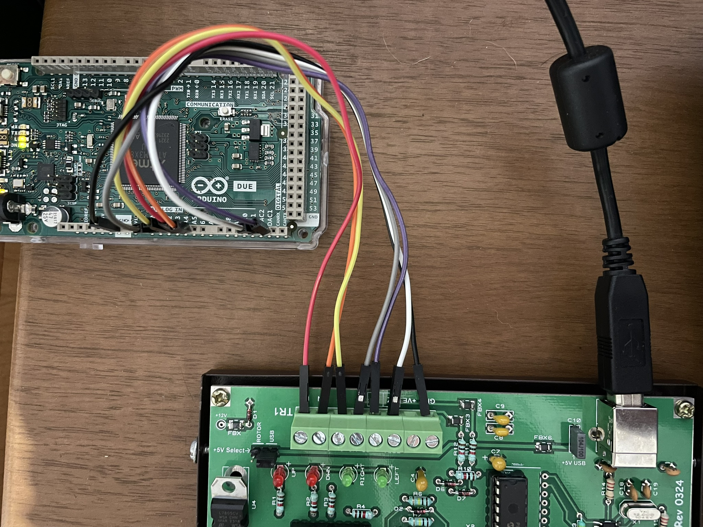

# Fox Delta ST-2 向け ローテータ シミュレータ

## 説明

Fox Delta ST-2 には、YAESU G-5500DC などを接続して利用しますが、
G-5500DC がない環境では ST-2 の動作確認ができません。
G-5500DC に変わるシミュレータとして ST-2 に Arduino を接続して ST-2 の動作確認を行うプログラムです。

ST-2からのLeft、Right、Up、Downの信号を受け、それに応じて変化させたAZ、ELを返します。（DACポートにAZ、EL値を電圧で応答します）

## ハード構成

PC <-> ST-2 <-> Arduino Due

※ ST-2 へ「真のアナログ値」を送信する必要があるため Arduino「Due」が必要です。
　 Arduino Nano などを使用した場合、アナログ出力が PWM となるため、ST-2 での AZ、EL 表示が非常に暴れます。

## ST-2 と Arduino Due のピン接続

| ST-2  | Arduino |
| ----- | ------- |
| AZ    | DAC0    |
| EL    | DAC1    |
| Left  | A2      |
| Right | A3      |
| Up    | A4      |
| Down  | A5      |
| GND   | GND     |



## 動作説明

### ST-2 のコンフィグ

ST-2 のコンフィグ（キャリブレーション）にて、ローテータ側を最大最小 AZ、EL の状態にする必要がある。
それに対応するため、`rotator_st2_simutator.ino`の以下を`true`に変更することでコンフィグを可能にする

```
const bool CONFIG = true;
```

1. 上記に変更した後、Arudino に書き込みを行う。
   ※Arduino への書き込み手順は割愛します。
2. Arudino と PC をシリアル接続状態にする。（Arduino IDE のシリアルモニタで良い）
3. ST-2 の起動直後に L、R、U、D いずれかが長押しして、コンフィグモードに入る。
4. 以下操作を行っていく。

   ①ST-2 画面 `Set Az=min & press D (U=esc)`

   - シリアルモニタ："3"を入力する。
   - ST-2："D"押下

   ②ST-2 画面 `Set El=min & press L (R=esc)`

   - シリアルモニタ："1"を入力する。
   - ST-2："L"押下

   ③ST-2 画面 `Set Az=max & press D (U=esc)`

   - シリアルモニタ："2"を入力する。
   - ST-2："D"押下

   ④ST-2 画面 `Set El=max & press L (R=esc)`

   - シリアルモニタ："0"を入力する。
   - ST-2："L"押下

   ⑤ST-2 画面 `Az range: 450 U 360 D (R=esc)`

   - ST-2："U"押下

   ⑥ST-2 画面 `El range: 0-90 U 0-180 D (R=esc)`

   - ST-2："D"押下

   ⑦ST-2 画面 `CCW stop North=U South D (R=esc`

   - ST-2："U"押下

   ⑧ST-2 画面 `EE Write: U (R=esc)`

   - ST-2："U"押下

5. スタブモードへの戻し
   以下に変更した後、Arudino に書き込みを行う。

```
const bool CONFIG = false;
```

### スタブモード

1. ST-2 と Arduino を起動する
2. ST-2 の L、R 押下。
   - Arduino へ L、R 値が送信され、応答された AZ が ST-2 に表示されます。
3. ST-2 の U、D 押下。
   - Arduino へ U、D 値が送信され、応答された EL が ST-2 に表示されます。
